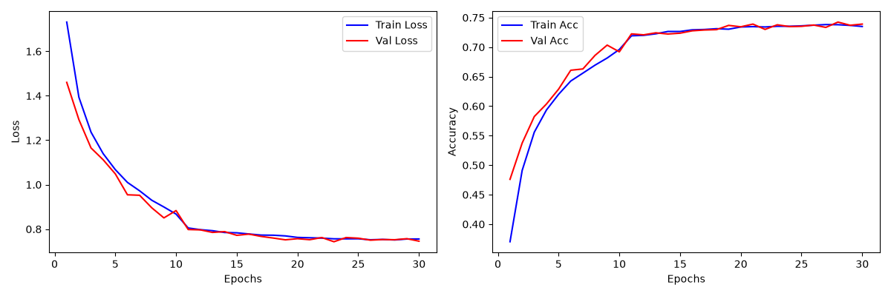
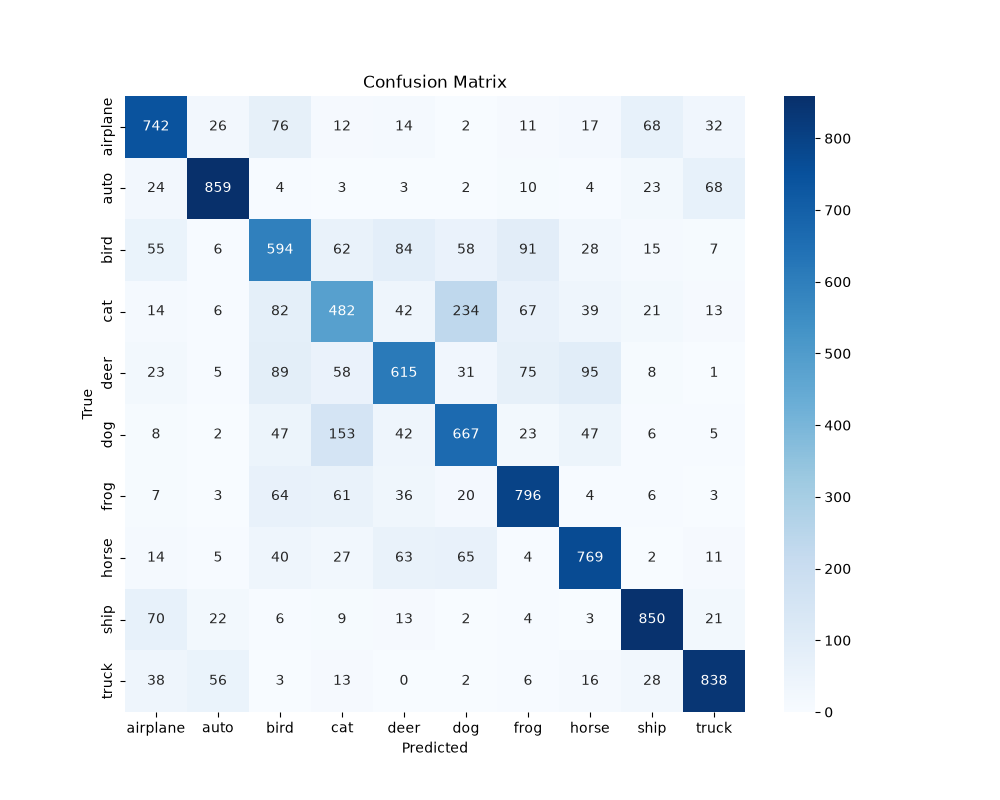

# CIFAR-10 图像分类项目

## 项目简介
基于 PyTorch 实现的 CIFAR-10 图像分类完整流程，包含自定义 CNN 与 ResNet 对比实验。

## 数据集
[CIFAR-10](https://www.cs.toronto.edu/~kriz/cifar.html) 数据集，10 个类别，图像大小 32x32。

## 实验结果
### 模型对比

| 模型 | 数据增强 | 测试准确率  |
|------|----------|--------|
| SimpleCNN | 随机翻转 + 裁剪 | 75.94% |
| ResNet18  | 随机翻转 + 裁剪 | 72.12% |

#### SimpleCNN训练曲线
#### ResNet18训练曲线

#### SimpleCNN混淆矩阵
#### ResNet18混淆矩阵

## 结果分析
ResNet18在相同训练轮次和学习率下准确率低于SimpleCNN，可能是因为
学习率过小导致收敛缓慢，且网络较深需要更多训练轮次。后续是演讲增大学
习率至0.1并增加训练轮次，预计能达到85%以上。

## 环境配置
```bash
pip install -r requirements.txt